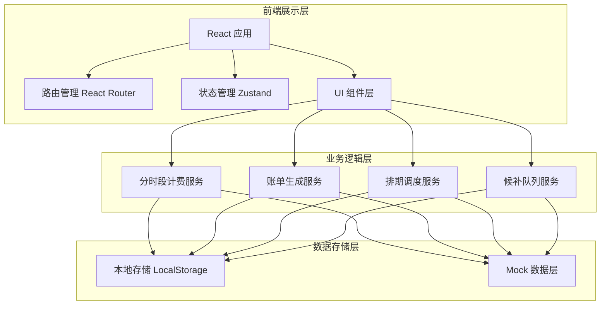
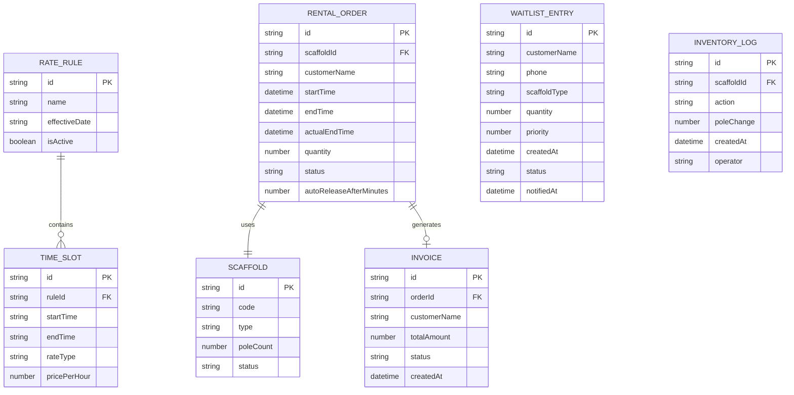

## 1. 架构设计



## 2. 技术描述

- **前端框架**：React@18 + TypeScript
- **构建工具**：Vite@5
- **样式方案**：Tailwind CSS@3 + CSS Variables（工业风主题）
- **路由管理**：React Router@6
- **状态管理**：Zustand（轻量级状态管理，跨组件共享租赁/计费/候补数据）
- **日期时间处理**：date-fns（时段拆分、跨天计算、费率切换点识别）
- **图表库**：recharts（仪表盘数据可视化、收入趋势图）
- **UI 组件**：自定义工业风组件（不使用第三方UI库，保持设计独特性）
- **后端**：无独立后端，使用 LocalStorage + Mock 数据模拟持久化
- **数据持久化**：LocalStorage（存储费率规则、脚手架档案、租赁订单、候补队列、账单记录）

## 3. 路由定义

| 路由 | 页面 | 用途 |
|------|------|------|
| /dashboard | 仪表盘 | 数据概览、统计图表、待办提醒 |
| /billing/rules | 计费规则配置 | 费率档位、时段定义配置 |
| /billing/rates | 时段费率表 | 费率列表维护、历史版本 |
| /billing/calculator | 计费计算器 | 实时分段计费计算 |
| /scaffold/list | 脚手架列表 | 脚手架档案管理 |
| /scaffold/schedule | 排期日历 | 租赁排期可视化 |
| /scaffold/inventory | 库存盘点 | 杆件数量统计与盘点 |
| /bills/list | 账单列表 | 账单查询与管理 |
| /bills/:id | 账单详情 | 账单明细展示与导出 |
| /waitlist/queue | 候补队列 | 候补登记与状态追踪 |
| /waitlist/notifications | 补位通知 | 补位通知日志 |

## 4. 核心服务层定义

### 4.1 分时段计费服务 (BillingService)

```typescript
interface TimeSlot {
  startTime: string; // "HH:mm"
  endTime: string;
  rateType: 'peak' | 'normal' | 'valley';
  pricePerHour: number;
}

interface RateRule {
  id: string;
  name: string;
  effectiveDate: string;
  slots: TimeSlot[];
  isActive: boolean;
}

interface BillingSegment {
  rateType: 'peak' | 'normal' | 'valley';
  startTime: Date;
  endTime: Date;
  durationHours: number;
  unitPrice: number;
  subtotal: number;
}

interface BillingResult {
  segments: BillingSegment[];
  totalAmount: number;
  totalHours: number;
}

class BillingService {
  static calculateRentalFee(
    startTime: Date,
    endTime: Date,
    quantity: number,
    ruleId: string
  ): BillingResult;

  static splitTimeByRateSlots(
    startTime: Date,
    endTime: Date,
    slots: TimeSlot[]
  ): BillingSegment[];

  static getActiveRule(): RateRule | null;
}
```

### 4.2 排期调度服务 (ScheduleService)

```typescript
interface Scaffold {
  id: string;
  code: string;
  type: string;
  poleCount: number;
  status: 'available' | 'rented' | 'maintenance';
}

interface RentalOrder {
  id: string;
  scaffoldId: string;
  customerName: string;
  startTime: Date;
  endTime: Date;
  actualEndTime?: Date;
  quantity: number;
  status: 'pending' | 'active' | 'completed' | 'overdue' | 'released';
  autoReleaseAfterMinutes: number;
}

class ScheduleService {
  static createRental(order: Omit<RentalOrder, 'id' | 'status'>): RentalOrder;
  static checkOverdueRentals(): RentalOrder[];
  static autoReleaseExpired(): void;
  static getAvailability(scaffoldId: string, date: Date): boolean;
  static getScheduleByDateRange(start: Date, end: Date): RentalOrder[];
}
```

### 4.3 候补队列服务 (WaitlistService)

```typescript
interface WaitlistEntry {
  id: string;
  customerName: string;
  phone: string;
  scaffoldType: string;
  quantity: number;
  priority: number;
  createdAt: Date;
  status: 'waiting' | 'notified' | 'confirmed' | 'expired' | 'cancelled';
  notifiedAt?: Date;
}

class WaitlistService {
  static addToWaitlist(entry: Omit<WaitlistEntry, 'id' | 'status' | 'createdAt'>): WaitlistEntry;
  static processAutoFill(scaffoldType: string, quantity: number): WaitlistEntry | null;
  static notifyNextCandidate(scaffoldType: string): WaitlistEntry | null;
  static confirmWaitlist(entryId: string): boolean;
  static getQueueByType(scaffoldType: string): WaitlistEntry[];
}
```

### 4.4 账单服务 (InvoiceService)

```typescript
interface Invoice {
  id: string;
  orderId: string;
  customerName: string;
  billingResult: BillingResult;
  createdAt: Date;
  status: 'draft' | 'issued' | 'paid' | 'overdue';
  totalAmount: number;
}

class InvoiceService {
  static generateInvoice(orderId: string): Invoice;
  static getInvoiceList(filters?: object): Invoice[];
  static exportInvoice(invoiceId: string, format: 'pdf' | 'excel'): Blob;
}
```

## 5. 数据模型 (ER图)



## 6. 状态管理 Store 结构

```typescript
interface AppStore {
  // 计费相关
  rateRules: RateRule[];
  activeRuleId: string | null;
  
  // 脚手架相关
  scaffolds: Scaffold[];
  rentalOrders: RentalOrder[];
  
  // 候补相关
  waitlist: WaitlistEntry[];
  
  // 账单相关
  invoices: Invoice[];
  
  // 库存相关
  inventoryLogs: InventoryLog[];
  
  // Actions
  setActiveRule: (id: string) => void;
  addRateRule: (rule: RateRule) => void;
  addScaffold: (scaffold: Scaffold) => void;
  createRental: (order: RentalOrder) => void;
  addToWaitlist: (entry: WaitlistEntry) => void;
  generateInvoice: (orderId: string) => void;
  processAutoRelease: () => void;
}
```
